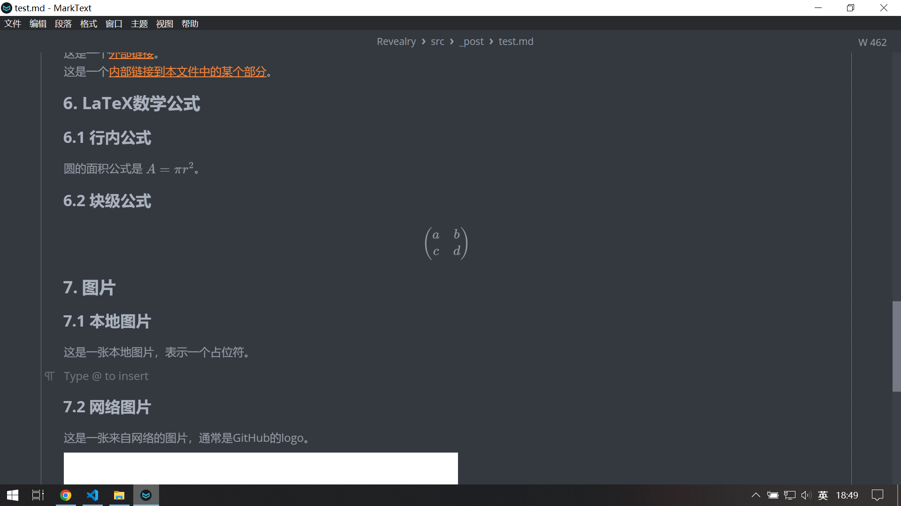

# Markdown测试

## 1. 普通文本和标题

这是一个普通的段落，包含一些**粗体文本**和*斜体文本*。你也可以使用~~删除线~~和<u>下划线（HTML）</u>。

### 1.1 子标题和引用

> 这是一个引用的例子。引用块可以用来突出重要的信息或者别人的话。

## 2. 列表

### 2.1 无序列表

* 列表项 A
* 列表项 B
  * 嵌套列表项 B.1
  * 嵌套列表项 B.2
* 列表项 C

### 2.2 有序列表

1. 第一个有序列表项

2. 第二个有序列表项
   
   1. 嵌套的第一个有序列表项
   2. 嵌套的第二个有序列表项

3. 第三个有序列表项

4. 1. 嵌套
   
   2. 嵌套
   
   3. 嵌套

## 3. 代码块

### 3.1 行内代码

你可以在行内使用 `print("Hello, World!")` 来表示代码。

### 3.2 代码块（带语法高亮）

```python
def factorial(n):
    if n == 0:
        return 1
    else:
        return n * factorial(n-1)
result = factorial(5)
print(f"5的阶乘是: {result}")
```

```javascript
console.log('fuck world')
```

```
文本文本文本
```

## 4. 表格

| 表头1         | 表头2         | 表头3         |
|:----------- |:-----------:| -----------:|
| 左对齐         | 居中对齐        | 右对齐         |
| Row 2 Col 1 | Row 2 Col 2 | Row 2 Col 3 |
| Row 3 Col 1 | Row 3 Col 2 | Row 3 Col 3 |

## 5. 链接

这是一个[外部链接](https://example.com)。
这是一个[内部链接到本文件中的某个部分](#2-列表)。

## 6. LaTeX数学公式

### 6.1 行内公式

圆的面积公式是 $A = \pi r^2$。

### 6.2 块级公式

$$
\begin{pmatrix}
a & b \\
c & d
\end{pmatrix}
$$

## 7. 图片

### 7.1 本地图片

这是一张本地图片，表示一个占位符。



### 7.2 网络图片

这是一张来自网络的图片，通常是GitHub的logo。

