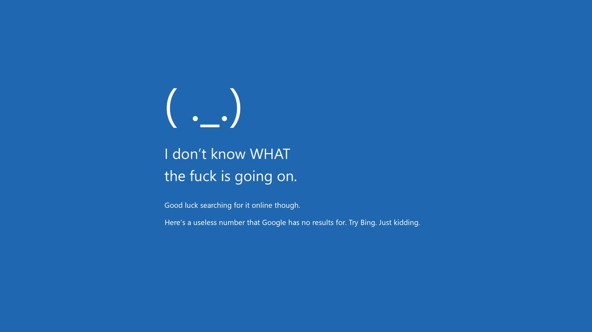

# Markdown Test 测试

## 1. Basic Text and Headings 基础文本和标题

This is a normal paragraph 这是一个普通段落, containing some **bold text 粗体文本** and *italic text 斜体文本*. You can also use ~~strikethrough 删除线~~ and <u>underline (HTML) 下划线</u>.

### 1.1 Subheadings and Quotes 子标题和引用

> This is a quote example 这是一个引用的例子

## 2. Lists 列表

### 2.1 Unordered List 无序列表

* List item A 列表项A
* List item B 列表项B
  * Nested item B.1 嵌套项B.1
  * Nested item B.2 嵌套项B.2
* List item C 列表项C

### 2.2 Ordered List 有序列表

1. First ordered item 第一个有序项
2. Second ordered item 第二个有序项
   1. Nested first 嵌套第一项
   2. Nested second 嵌套第二项
3. Third ordered item 第三个有序项

## 3. Code Blocks 代码块

### 3.1 Inline Code 行内代码

You can use `print("Hello, World!") #打印语句` in line.

### 3.2 Code Block 代码块

```python
def greet(name):
    print(f"Hello, {name}!")  # 打印问候语
```

## 4. Tables 表格

| Header1 表头1 | Header2 表头2 | Header3 表头3 |
|:----------- |:-----------:| -----------:|
| Left align 左对齐 | Center 居中 | Right align 右对齐 |
| Data 数据1 | Data 数据2 | Data 数据3 |

## 5. Links 链接

This is an [external link 外部链接](https://example.com).
This is an [internal link 内部链接](#2.-lists-列表).

## 6. LaTeX

such as $E = mc^2$ or $A = \pi r^2$

$$
\begin{pmatrix}
a & b \\
c & d
\end{pmatrix}
$$

## 7. 图片

## 7. Images 图片

### Local Image 本地图片



### Web Image 网络图片

